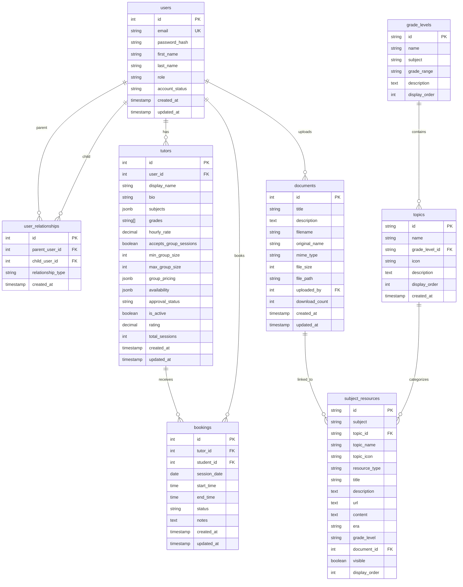

# Database Schema Diagram

Industry-standard schema with 8 tables focused on active features.



## Quick Reference

### Main Tables
- **users**: All platform users (students, parents, teachers, tutors, admins, owner)
- **user_relationships**: Parent-child relationships (many-to-many junction table)
- **tutors**: Tutor-specific information linked to user accounts
- **bookings**: Tutoring session bookings

### Resource Management
- **grade_levels**: Subject-based grade level organization (Elementary, Middle, High School, College)
- **topics**: Main topics under each grade level (e.g., "Arithmetic" under Elementary Math)
- **subject_resources**: Educational resources (worksheets, videos, quizzes, lessons)

### Content Storage
- **documents**: File storage only (PDFs, worksheets) - contains file metadata, not educational metadata

### Key Design Principle
- **documents** = File storage (filename, size, path, mime type)
- **subject_resources** = Educational metadata (topic, grade level, resource type)
- They link via `document_id` to keep concerns separated

## Table Relationships

### User Hierarchy
```
users (all authentication)
  ├── user_relationships (parent ↔ child mapping)
  └── tutors (extended tutor profile)

Example:
Parent User (id=1) ←→ user_relationships ←→ Student User (id=5)
  relationship: parent_user_id=1, child_user_id=5
```

### Resource Organization
```
grade_levels (e.g., Elementary Math)
  └── topics (e.g., Arithmetic)
      └── subject_resources (worksheets, videos, quizzes, lessons)
          └── documents (PDF files)
```

### How It Works
```
Student searches "addition worksheets"
  → Query: subject_resources WHERE title LIKE '%addition%' AND resource_type = 'worksheet'
  → Returns: All addition worksheets with their linked PDF files
```
